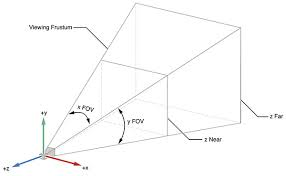

GLTFJSX fixes that
🧑‍💻 It creates a virtual graph of all objects and materials. Now you can easily alter contents and re-use.
🏎️ The graph gets pruned (empty groups, unnecessary transforms, ...) and will perform better.
⚡️ It will optionally compress your model with up to 70%-90% size reduction.

- gltfjsx

  - gltf, glb 등의 3d모델을 jsx 변환
  - npx gltfjsx [location] [option]

    - npx gltfjsx public/model.gltf --types --transform

    https://github.com/pmndrs/gltfjsx?tab=readme-ov-file

---

- `<Model position={[1, 0, 0]} />`(OrbitControl 사용)

  - 생성된 jsx Element의 props로 position전달시, 회전의 중심축의 위치가 바뀐다.

- ambientLight의 적용x
  - metalness의 따라 바뀜. 빛에 반사에 의해 결정되는데 주변의 반사 할 environment가 없으면 ambientLight가 적용안된다고함.
  - positionLight, directionalLight에 의해 조명효과를 낼수 있으나 texture가 metalness임에 따라 environment설정이 불가피해보임.
    - Environment setting => three/drei의 Environment를 사용하면 매우 간단하게 반사될 주변환경을 만들수 있다.
      - `<Environment preset='forest' />` (기본 preset을 사용 et. apartment,city,dawn,sunset)

### model, light, environment

---

camera position

---

## learn ThreeJS Fundimental
